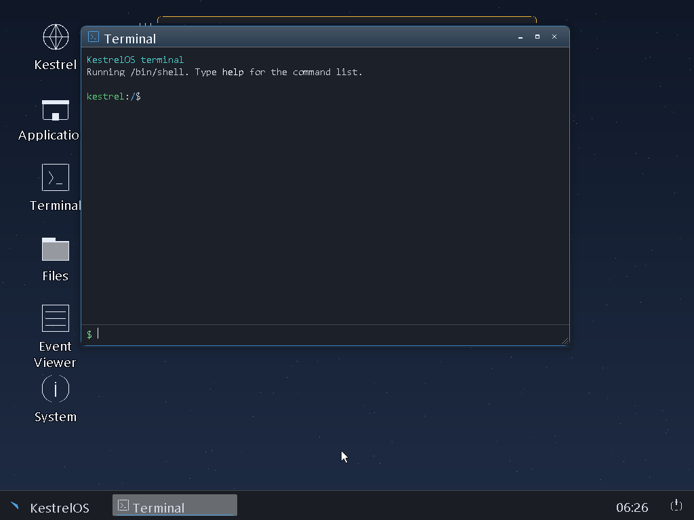

# KestrelOS

KestrelOS is an experimental x86-64 operating-system project. It has a custom
UEFI loader, a freestanding kernel, ring-3 processes, device drivers, a C
userland, and a graphical desktop. This repository publishes the source code
and selected tests for technical review.

## Code map

| Directory | Contents |
| --- | --- |
| `boot/` | UEFI loader and boot protocol |
| `kernel/` | scheduling, memory management, system calls, storage, USB, audio, networking, graphics, and device drivers |
| `common/` | filesystem code shared by the loader and kernel |
| `include/kestrel/` | interfaces shared across kernel and user programs |
| `user/` | C library, shell, desktop, applications, browser components, and compatibility experiments |
| `tests/` | small native, Linux, and Windows program fixtures |
| `tools/` | image builders, host-side tests, VM automation, and font generators |

The source explores UEFI boot, preemptive process scheduling, FAT/NTFS and
other filesystem implementations, xHCI input, HD Audio, Ethernet, Wi-Fi, a
window system, and GPU integration. The code also contains experimental Linux
and Windows application compatibility paths. Those paths vary in completeness;
the presence of source code is not a claim of general application compatibility.

## Build status

The UEFI loader and userland were built successfully from this public source
snapshot with `python build.py boot` and `python build.py user` on Windows using
LLVM/Clang. Before building userland, run `tools/generate_required_fonts.ps1`
with locally licensed fonts. A full kernel/image build
has additional local prerequisites that are not redistributed here: NVIDIA
driver objects and headers, firmware for physical devices, and locally generated
font glyphs. See [PUBLIC_SNAPSHOT.md](docs/PUBLIC_SNAPSHOT.md) before attempting
`python build.py`.

The desktop screenshot is from an earlier VM run of the local project. It is
visual evidence of the desktop, not proof that every driver or compatibility
path works on arbitrary hardware.

## Source and dependencies

This repository contains project source, build scripts, and tests. It does not
contain private Secure Boot keys, device ROM dumps, extracted vendor binaries,
firmware packages, or fonts rasterized from commercial typefaces. See
[THIRD_PARTY_NOTICES.md](THIRD_PARTY_NOTICES.md) for dependency boundaries.

No license has been granted for the original project code in this snapshot.
